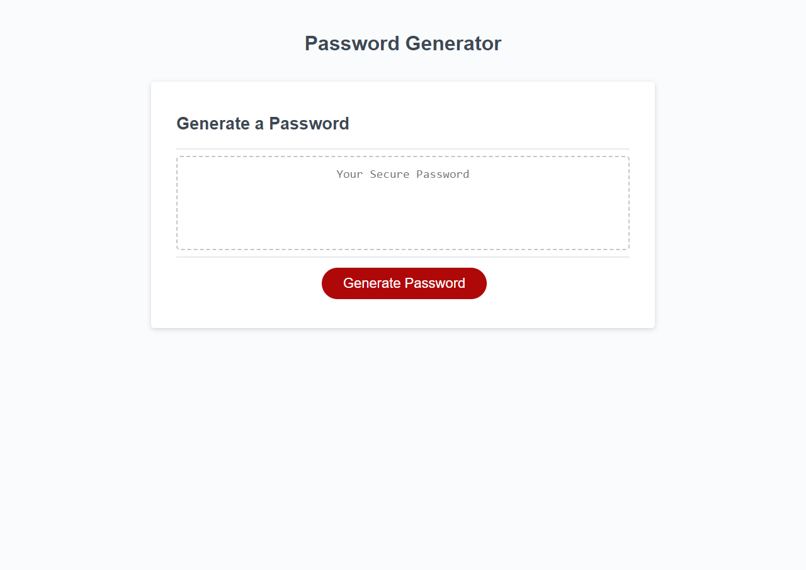

# Password Generator  

# Description
This project was a pain to do but so satisfying to see it come together. the challange of moving through functions and interfacing with the html at the end really made me think.

## Installation
to insall this project, clone the repository from [github](https://github.com/b0n3yard/Secure-Random-password-generator) and open index.html in the chrome browser. alternatively you can view the finished page [here](https://b0n3yard.github.io/Secure-Random-password-generator/)

## Usage

## Credits
Michael Klein
and a lot of help from [W3schools](https://www.w3schools.com/js/default.asp)

## Li